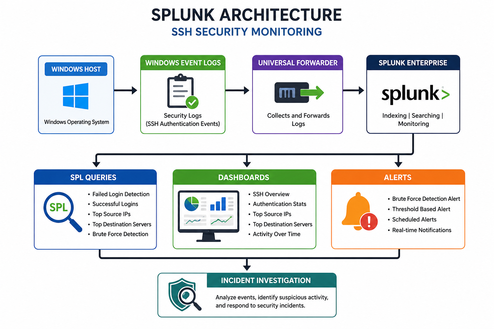
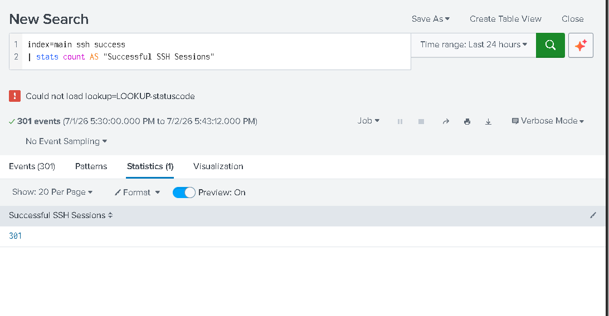
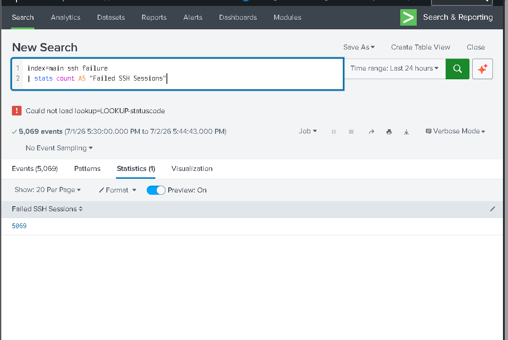
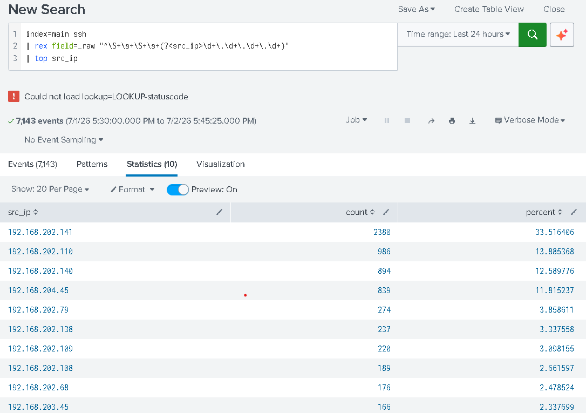
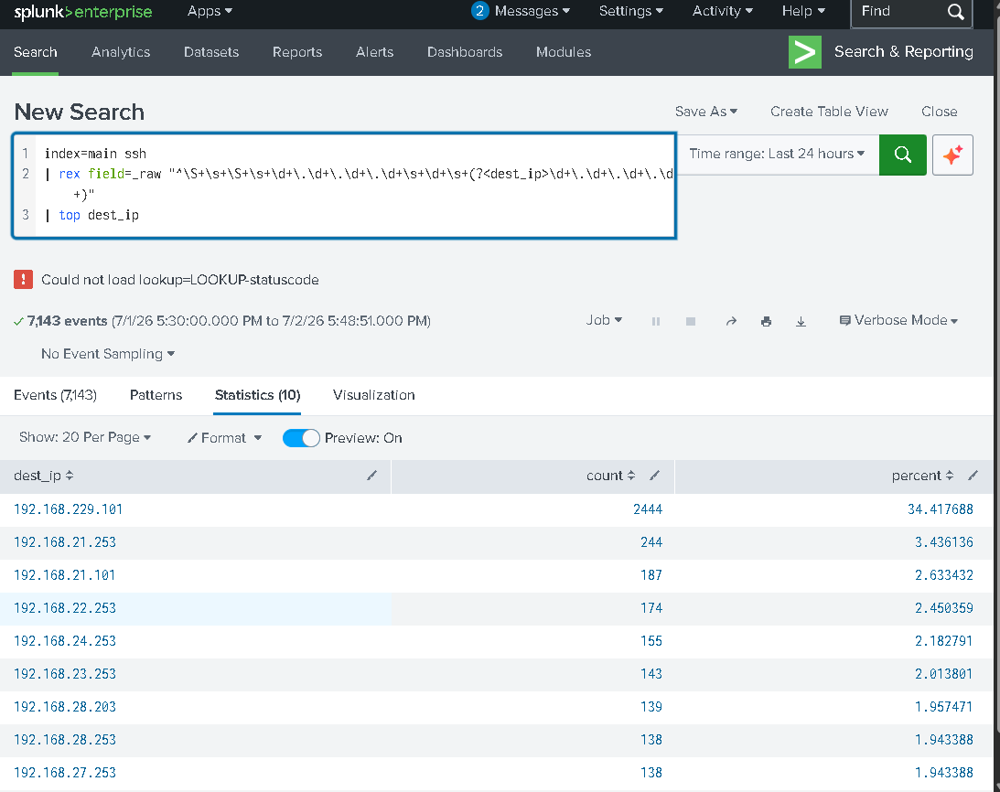
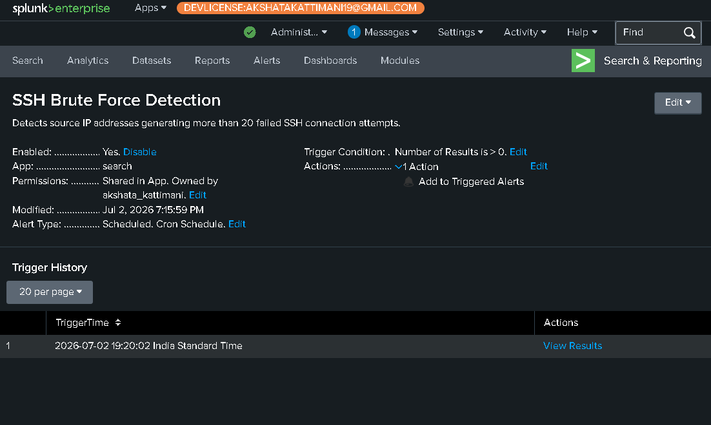
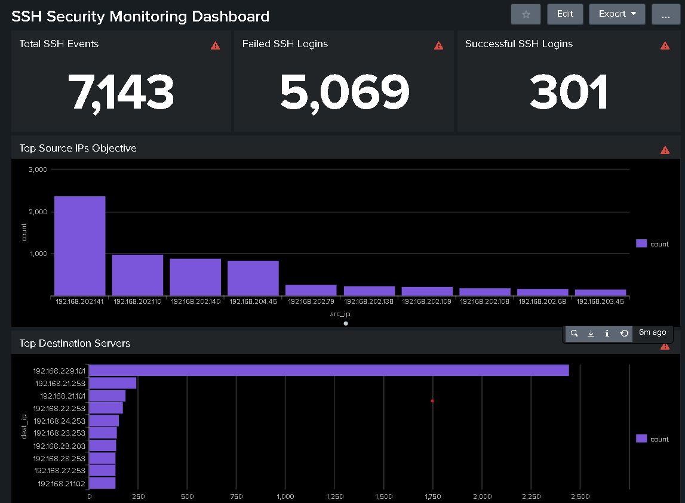

# splunk-ssh-security-monitoring
SSH authentication monitoring, SPL query development, dashboard creation, alerting, and incident investigation using Splunk Enterprise.

# SSH Security Monitoring using Splunk Enterprise


---

# 📌 Project Overview

This project demonstrates SSH security monitoring using Splunk Enterprise to analyze authentication events, monitor SSH activity, identify suspicious login attempts, and detect brute-force attacks through dashboards, SPL queries, scheduled reports, and alerts.

The project simulates a Security Operations Center (SOC) workflow by collecting SSH logs, visualizing security events, configuring dashboards, and generating alerts for abnormal authentication activity.

---

# 🎯 Challenge Objective

The objective of this project is to analyze SSH log files using Splunk Enterprise to:

- Monitor successful SSH authentication
- Detect failed SSH login attempts
- Identify top source IP addresses
- Monitor destination servers
- Detect SSH brute-force attacks
- Configure scheduled alerts
- Build security monitoring dashboards

---

# 🛠 Technologies Used

- Splunk Enterprise
- Universal Forwarder
- Windows Event Logs
- Search Processing Language (SPL)
- SSH Log Analysis

---

# 💼 Skills Demonstrated

- SIEM Monitoring
- Log Analysis
- Dashboard Development
- SPL Query Writing
- SSH Authentication Monitoring
- Brute Force Detection
- Scheduled Reports
- Alert Configuration
- Incident Investigation

---

# 🏗 Splunk Architecture

<p align="center">

</p>

---

# 📂 Repository Structure

```
splunk-ssh-security-monitoring/
│
├── README.md
├── LICENSE
├── diagrams/
│     └── splunk_architecture.png
│
├── screenshots/
│     ├── successful_ssh_sessions.png
│     ├── failed_ssh_sessions.png
│     ├── top_source_ips.png
│     ├── top_destination_servers.png
│     ├── brute_force_alert.png
│     ├── dashboard_overview.png
│     └── activity_analysis.png
│
├── reports/
│     └── SSH_Log_Analysis_Report.pdf
│
└── queries/
      └── splunk_queries.md
```

---

# 📊 Dashboard Components

## Successful SSH Sessions

Displays the total number of successful SSH authentication events detected in the uploaded log data. This visualization helps verify legitimate user access and compare successful authentication attempts with failed logins.

---

## Failed SSH Sessions

Displays failed SSH authentication attempts. A high number of failures may indicate password guessing, brute-force attacks, or unauthorized access attempts requiring investigation.

---

## Top Source IP Addresses

Identifies the source IP addresses generating the highest volume of SSH traffic. Systems with unusually high activity may represent scanners, attackers, or heavily used administrative hosts.

---

## Top Destination Servers

Highlights the destination servers receiving the largest number of SSH connection attempts, helping identify critical systems that require closer monitoring.

---

## SSH Brute Force Detection Alert

A scheduled Splunk alert was configured to detect source IP addresses generating excessive failed SSH authentication attempts. When the threshold is exceeded, Splunk triggers an alert for further investigation.

---

## SSH Security Monitoring Dashboard

The dashboard provides a centralized view of SSH authentication statistics and network activity, allowing SOC analysts to monitor authentication events from a single interface.

---

## Activity Analysis

This section visualizes SSH authentication outcomes over time.

Visualizations include:

- Successful vs Failed Authentication
- SSH Activity Timeline
- Authentication Trends

These visualizations help analysts identify traffic spikes and suspicious login behavior.

---

# 🔍 Investigation Workflow

```
SSH Log Collection
        │
        ▼
Data Ingestion
        │
        ▼
SPL Queries
        │
        ▼
Dashboard Visualization
        │
        ▼
Authentication Analysis
        │
        ▼
Brute Force Detection
        │
        ▼
Scheduled Alert
        │
        ▼
Incident Investigation
```

---

# 📸 Screenshots

## Successful SSH Sessions



---

## Failed SSH Sessions



---

## Top Source IP Addresses



---

## Top Destination Servers



---

## SSH Brute Force Detection Alert


---

## SSH Dashboard Overview


---


---

# 📈 Key Outcomes

- Successfully monitored SSH authentication activity.
- Identified successful and failed SSH login attempts.
- Monitored top communicating systems.
- Configured scheduled brute-force detection alerts.
- Developed centralized SSH monitoring dashboards.
- Improved visibility into authentication events using Splunk Enterprise.

---

# 📚 Learning Outcomes

Through this project, I gained practical experience in:

- Splunk Enterprise Administration
- SPL Query Development
- SSH Log Analysis
- Dashboard Development
- Security Monitoring
- Authentication Analysis
- Brute Force Detection
- Alert Configuration
- SOC Investigation Workflow

---

# 🚀 Future Improvements

- Integrate email notifications for alerts.
- Expand monitoring to additional log sources.
- Develop advanced correlation searches.
- Create custom detection rules.
- Integrate MITRE ATT&CK mapping.

---

# 📝 Conclusion

This project demonstrates how Splunk Enterprise can be used to monitor SSH authentication events, detect suspicious login activity, identify brute-force attacks, and improve security visibility through dashboards, SPL queries, scheduled reports, and alerts. It reflects practical SOC analyst tasks including log analysis, security monitoring, and incident investigation.

---

# 👩‍💻 Author

**Akshata Kattimani**

Cybersecurity Intern

SOC Analyst Aspirant

---

# 📄 License

This project is licensed under the MIT License.
